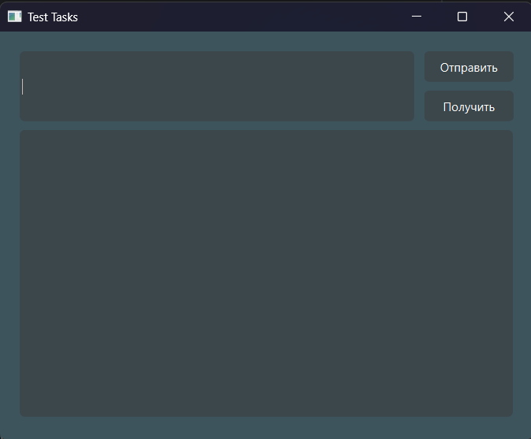

## Тестовое задание по Python. (Компания МАСТ)
### Используемые библиотеки:
- requests
- pySide6
- FastAPI
- Pydantic
- SqlAlchemy
- sqlite3
- pyinstaller

В этом задании требуется написать 2 небольших приложения: клиентское приложение с
интерфейсом на базе PySide6 и серверную часть на базе FastAPI.

<b>Клиент</b>: написать приложение с использованием графического интерфейса на базе
библиотеки Qt. В основном окне приложения должны быть расположены следующие
элементы: QLineEdit, QListView, QPushButton 2шт..
- По нажатию одной кнопки QPushButton должен отправиться запрос POST через библиотеку
requests к серверу в виде json структуры и содержать в себе информацию: текст из QlineEdit,
текущую дату, текущее время, порядковый номер клика на кнопку.
- По нажатию второй кнопки отправляется запрос GET через библиотеку requests к серверу,
который возвращает данные в виде json структуры и эту информацию отобразить в
QListView.
Сервер: написать простенькое приложение с использованием билиотек FastAPI, SQLAlchemy
и БД sqlite. У сервера должно быть два эндпоинта.
- На один эндпоинт разрешено делать только POST запрос. При поступлении запроса с
данными в json формате на этот эндпоинт они записываются в табилицу в базе данных
SQLite.
- На второй эндпоинт разрешено делать только GET запрос. При поступлении запроса на этот
эндпоинт из таблицы данных в базе SQLite забираются записи и возврщаются клиенту в json
формате. Должна поддерживаться пагинация с возможностью указания количества записей
на страницу. Взаимодействие с БД реализовать с помощь. SQLAlchemy.
Названия эндпоинтов на своё усмотрение, так же как и структуры таблиц и описание полей,
формат JSON файла с описанием и т. д.

Для валидации входных данных и выдачи результата используйте Pydantic.
Должна использоваться аннотация типов в приложении.
Написать как минимум 3 теста для клиента и для сервера.

Когда задание будет выполнено, собрать приложения в *.exe файлы: сервер должен быть
собран с опцией onedir, а приложение — onefile. Исходники с собранными проектами
разместить на GitHub и прислать ссылку на репозиторий.

<b>ВАЖНО</b>: Оценивается не факт работает или нет, а подход, структура проекта, заложенная
обработка исключений и внештатных ситуаций и подход в целом. Если приложение просто
работает — это не результат.

## Клиент

